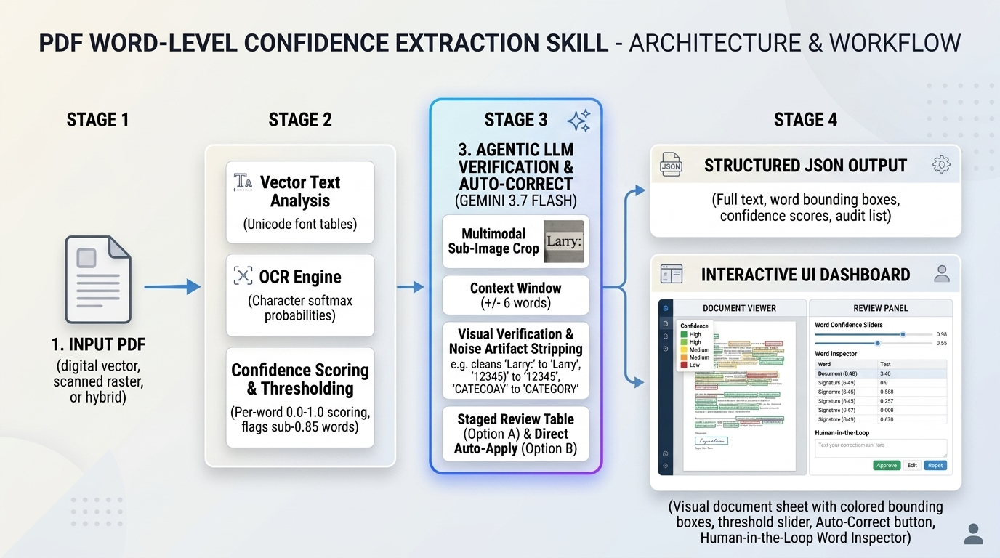

# PDF Word-Level Confidence Extraction Skill

An agent skill and standalone Python tool designed for conversational AI agents, LLM tool-use systems, and autonomous agent harnesses. It extracts text from PDF documents (digital vector, scanned raster, or hybrid), computes normalized per-word confidence scores in the range [0.0, 1.0], outputs structured JSON, and provides an interactive UI Dashboard for visual verification and human-in-the-loop correction. It also integrates an agentic LLM correction stage powered by Gemini 3.7 Flash to review and resolve low-confidence OCR misrecognitions with surrounding context awareness.



---

## Table of Contents

1. Project Overview
2. System Architecture
3. Directory Structure
4. Installation and Setup
   - Prerequisites and OCR Engine Setup
   - Install Dependencies
   - Verify Installation
5. How to Use the Python Code
   - Command Line Interface (CLI)
   - Python Library API
   - Agentic LLM Word Correction Pipeline
6. Interactive UI Dashboard
   - Overview and Capabilities
   - Visual PDF Page and Bounding Box View
   - Confidence Cutoff Slider
   - Gemini Auto-Correction and Review Workflows
   - Human-in-the-Loop Word Editor
   - Audit Queue Review
   - Light and Dark Theme Toggle
   - Generating Standalone Dashboard Bundles
7. Non-Technical User Guide: Using the Skill in an Agent Harness
   - Overview for Non-Technical Users
   - What the Skill Needs to Run
   - Step-by-Step Execution Workflow
   - Understanding Confidence Scores
   - Context-Aware AI Correction (Gemini 3.7 Flash)
   - Real-World Prompt Examples & Workflows
   - Sample Agent Conversation and Output
   - How to Use the Visual Dashboard for Corrections
8. Sample and Test Documents
9. JSON Output Schema Reference
10. Running the Test Suite
   - Option A: Standard Python unittest (Built-in)
   - Option B: Using pytest
11. License and Contribution

---

## 1. Project Overview

Standard PDF extraction tools often return plain text without indicating how reliable each extracted token is. In real-world enterprise workflows (such as invoice processing, compliance audits, and record digitization), downstream systems need to distinguish between high-certainty text and potential OCR misrecognitions.

This project delivers:
- Extraction Modality Detection: Automatically distinguishes between digital vector pages and scanned image pages.
- Per-Word Confidence Scoring: Every extracted word is assigned a confidence score between 0.0 and 1.0.
- Dual-Purpose JSON Output: Contains both consolidated full text for immediate NLP/LLM ingestion and a structured word-by-word array with coordinates (`bbox`) for audit trails.
- Low-Confidence Flagging: Automatically isolates words scoring below a configurable cutoff threshold (default: 0.85) into a dedicated audit array.
- Context-Aware LLM Word Correction: Uses Gemini 3.7 Flash with a surrounding context window (+/- 6 tokens) to analyze ambiguous tokens, fix OCR misrecognitions (such as `INV-2O26` to `INV-2026` or trailing punctuation artifacts like `12345)` to `12345`), and approve legitimate domain terms.
- Dual Review Modes: Supports Staged Review (Option A, default) with a 1-click batch application table, as well as Direct Auto-Apply (Option B) with an interactive undo stack.
- Interactive UI Dashboard: A responsive HTML/CSS/JavaScript interface featuring dynamic threshold sliders, visual PDF page bounding boxes, light/dark themes, and human-in-the-loop editing.
- Multi-Harness Compatibility: Packaged as a standard Skill (`skills/pdf-extract-confidence/SKILL.md`) that works seamlessly across standard agent harnesses, IDE extensions, and skill plugin environments.

---

## 2. System Architecture

The extractor implements a hybrid pipeline:

1. Modality Assessment:
   - Digital Vector Pages: Extracted directly via vector streams (`pdfplumber` / `pypdf`). Confidence is evaluated against character encoding integrity (valid Unicode mapping = 1.0, replacement characters or unmapped glyphs = degraded score).
   - Scanned Pages: Rendered to high-resolution bitmaps and processed via Optical Character Recognition (OCR). Word confidence is derived from character classifier softmax probabilities.
   - Hybrid Pages: Pages containing vector text alongside raster stamps or signatures are processed to extract all readable elements.
2. Coordinate Normalization: Bounding boxes are computed in standard PDF point dimensions (72 points per inch) with top-left origin.
3. Metric Computation: Global mean confidence, minimum confidence, total word count, and low-confidence counts are computed and recorded in the metadata block.
4. Agentic LLM Word Correction (Optional / On-Demand):
   - Low-confidence tokens are packaged with their surrounding context (+/- 6 tokens) into a structured schema.
   - Gemini 3.7 Flash analyzes each token to either suggest a correction with an explanation or approve the word as-is.
   - Corrections are staged in an audit table (Option A) or applied directly to the document token stream (Option B).
5. UI Dashboard Rendering: Interactive client-side application renders pages with SVG/DOM overlays, synchronized word selection, and real-time JSON export.
6. Schema Validation: All outputs conform to `skills/pdf-extract-confidence/resources/schema.json`.

---

## 3. Directory Structure

```text
pdf-extract-confidence-skill/
├── LICENSE                                # Apache License 2.0
├── README.md                              # Main documentation and project guide
├── requirements.txt                       # Python dependencies
├── pyproject.toml                         # Packaging specification
├── assets/
│   └── skill_workflow_diagram.jpg         # Skill architecture and workflow overview
├── skills/
│   └── pdf-extract-confidence/
│       ├── SKILL.md                       # Agent skill definition and runbook
│       ├── ui/
│       │   ├── index.html                 # Interactive UI Dashboard
│       │   ├── styles.css                 # Responsive stylesheet (Light and Dark themes)
│       │   ├── app.js                     # Slider filtering, coordinate mapping, and HITL logic
│       │   ├── latest_data.js             # Embedded dataset cache for local UI preview
│       │   └── latest_extraction.json     # Last extracted JSON document payload
│       ├── scripts/
│       │   ├── extract_pdf.py             # Core extraction engine, CLI, and HTML bundler
│       │   ├── generate_samples.py        # Synthetic sample PDF generator
│       │   └── llm_correction.py          # Gemini 3.7 Flash LLM word correction engine
│       ├── resources/
│       │   ├── schema.json                # JSON Schema for extraction output
│       │   └── sample_output.json         # Reference JSON output structure
│       └── references/
│           ├── confidence_scoring.md      # Confidence scoring methodology
│           └── cloud_adapters.md          # Cloud Document OCR adapters guide
├── samples/
│   ├── 104-10062-10073.pdf                # Scanned historical record PDF (pure scan)
│   ├── 104-10062-10073_extracted.json     # Extracted JSON with OCR word confidences
│   ├── 104-10062-10073_dashboard.html     # Interactive review dashboard for scan
│   ├── sample_digital_invoice.pdf         # Synthetic digital invoice (0% PHI)
│   ├── sample_digital_invoice_extracted.json
│   ├── sample_digital_invoice_dashboard.html
│   ├── sample_mixed_report.pdf            # Synthetic mixed report (0% PHI)
│   ├── sample_mixed_report_extracted.json
│   ├── sample_mixed_report_dashboard.html
│   ├── sample_scanned_receipt.pdf         # Synthetic raster scan (0% PHI)
│   ├── sample_scanned_receipt_extracted.json
│   └── sample_scanned_receipt_dashboard.html
└── tests/
    ├── __init__.py
    ├── test_extractor.py                  # Unit, CLI, OCR, and Dashboard integration tests
    ├── test_llm_correction.py             # LLM context extraction, prompt, and correction tests
    └── test_schema.py                     # Schema validation tests
```

---

## 4. Installation and Setup

### Prerequisites
- Python 3.9 or higher.
- **OCR Engine (required for scanned raster PDFs and image-only documents)**:
  - **macOS (Homebrew)**:
    ```bash
    brew install tesseract
    ```
  - **Debian / Ubuntu / Docker**:
    ```bash
    sudo apt-get update && sudo apt-get install -y tesseract-ocr
    ```
  - **Fedora / RHEL / CentOS**:
    ```bash
    sudo dnf install -y tesseract
    ```
  - **Windows (winget / Chocolatey)**:
    ```powershell
    winget install UB-Mannheim.TesseractOCR
    # or with Chocolatey:
    choco install tesseract
    ```
  - **Python / Rootless Environments (No System Binary Needed)**:
    ```bash
    pip install rapidocr-onnxruntime
    ```
    This pure-Python engine runs via ONNX Runtime without requiring administrative root permissions or external C++ binaries.

### Install Dependencies

```bash
pip install -r requirements.txt
```

To install development and optional OCR dependencies:

```bash
pip install -e ".[dev,ocr]"
```

### Verify Installation

Run the test suite to confirm everything is working properly:

```bash
pytest -v tests/
```

Or using standard Python built-in `unittest`:

```bash
python3 -m unittest discover -s tests -v
```

---

## 5. How to Use the Python Code

### Command Line Interface (CLI)

The extraction script can be executed directly from the terminal.

#### Basic Extraction
```bash
python3 skills/pdf-extract-confidence/scripts/extract_pdf.py \
  --input samples/sample_digital_invoice.pdf \
  --output output.json
```

#### Extract and Generate Standalone HTML Dashboard
Generate both the JSON output and a self-contained interactive dashboard bundle:
```bash
python3 skills/pdf-extract-confidence/scripts/extract_pdf.py \
  --input samples/sample_digital_invoice.pdf \
  --output output.json \
  --html-output dashboard.html
```

#### Extract with Custom Confidence Threshold
Set the cutoff threshold (between 0.0 and 1.0) below which words are flagged in the `low_confidence_words` audit list:
```bash
python3 skills/pdf-extract-confidence/scripts/extract_pdf.py \
  --input samples/sample_digital_invoice.pdf \
  --output output.json \
  --threshold 0.90
```

#### Extract with Agentic Gemini LLM Word Correction (Option A: Staged Review)
Run extraction and stage AI suggestions in the review table using Gemini 3.7 Flash:
```bash
python3 skills/pdf-extract-confidence/scripts/extract_pdf.py \
  --input samples/sample_scanned_receipt.pdf \
  --output output.json \
  --html-output receipt_dashboard.html \
  --llm-correct \
  --gemini-api-key "$GEMINI_API_KEY"
```

#### Extract and Auto-Apply Gemini Corrections Directly (Option B)
Run extraction, query Gemini 3.7 Flash, and immediately apply approved word corrections to the document:
```bash
python3 skills/pdf-extract-confidence/scripts/extract_pdf.py \
  --input samples/sample_scanned_receipt.pdf \
  --output output.json \
  --html-output receipt_dashboard.html \
  --llm-correct \
  --llm-auto-apply \
  --gemini-api-key "$GEMINI_API_KEY"
```

#### Enforce Extraction Mode
Choose between `auto` (default), `digital`, or `ocr`:
```bash
python3 skills/pdf-extract-confidence/scripts/extract_pdf.py \
  --input samples/sample_scanned_receipt.pdf \
  --output output.json \
  --mode ocr
```

#### Validate Against JSON Schema
Append `--validate` to verify that the generated output complies with `schema.json`:
```bash
python3 skills/pdf-extract-confidence/scripts/extract_pdf.py \
  --input samples/sample_mixed_report.pdf \
  --output output.json \
  --validate
```

#### CLI Options Reference

Option | Type | Default | Description
:--- | :--- | :--- | :---
`-i, --input` | String | (Required) | Path to the PDF file to process.
`-o, --output` | String | None | Path to save output JSON. If omitted, prints to stdout.
`--html-output` | String | None | Path to generate a standalone interactive HTML dashboard.
`-t, --threshold` | Float | `0.85` | Cutoff score in range [0.0, 1.0] for low-confidence audit list.
`-m, --mode` | String | `auto` | Extraction modality: `auto`, `digital`, or `ocr`.
`--llm-correct` | Flag | `False` | Run LLM word correction on low-confidence tokens.
`--llm-auto-apply` | Flag | `False` | Auto-apply LLM corrections directly (Option B) instead of staging.
`--llm-model` | String | `gemini-3.7-flash` | Gemini model ID for corrections.
`--gemini-api-key` | String | None | Gemini API Key (or set via `GEMINI_API_KEY` env var).
`--mock-llm` | Flag | `False` | Uses local heuristic mock for testing without API keys.
`--tesseract-cmd` | String | None | Explicit path to Tesseract binary (or set via `TESSERACT_CMD` env var).
`--dpi` | Integer | `200` | Rendering resolution (DPI) for rasterizing pages before OCR.
`--validate` | Flag | `False` | Validates generated JSON against `resources/schema.json`.
`--compact` | Flag | `False` | Produces unformatted compact JSON instead of indented output.

---

### Python Library API

You can import and use the extractor directly within your own Python applications.

```python
from pathlib import Path
from skills.pdf_extract_confidence.scripts.extract_pdf import (
    PDFConfidenceExtractor,
    generate_html_dashboard,
)
from skills.pdf_extract_confidence.scripts.llm_correction import (
    GeminiWordCorrector,
    run_llm_correction_pipeline,
)

# Initialize extractor with default threshold
extractor = PDFConfidenceExtractor(default_threshold=0.85)

# Process PDF document
result = extractor.extract(
    pdf_path="samples/sample_digital_invoice.pdf",
    threshold=0.85,
    mode="auto"
)

# Access document metadata
print("Filename:", result.filename)
print("Total Words:", result.total_words)
print("Mean Confidence:", result.mean_confidence)
print("Low Confidence Words Count:", result.low_confidence_count)

# Access full extracted text
print("Document Text:\n", result.full_text)

# Access per-word confidence data on page 1
for word_item in result.pages[0].words[:5]:
    print(f"Word: {word_item.word:<15} | Confidence: {word_item.confidence:.2f} | Source: {word_item.source}")

# Export to JSON string or dictionary
json_data = result.to_json(indent=2)
output_dict = result.to_dict()

# Optional: Run Gemini 3.7 Flash LLM Word Correction Pipeline
corrector = GeminiWordCorrector(model="gemini-3.7-flash")
enhanced_dict = corrector.process_extraction_payload(
    payload=output_dict,
    auto_apply=False  # True for Option B, False for Option A
)

# Generate standalone HTML Dashboard
generate_html_dashboard(enhanced_dict, "invoice_dashboard.html")
```

---

## 6. Interactive UI Dashboard

The UI Dashboard (`skills/pdf-extract-confidence/ui/index.html`) is a responsive, single-page application built with HTML, CSS, and JavaScript. It runs directly inside iframe containers in agent applications as well as in any modern desktop web browser.

### Features & Capabilities

1. **Visual Document Page & Bounding Box View (Left Pane)**:
   - Displays the rendered PDF page geometry with standard point coordinate scaling (72 points per inch).
   - Supports digital vector invoices, multi-page reports, and scanned thermal receipts with adapted typography and document modality badges (`Digital Vector`, `Hybrid Multi-Page`, `Scanned OCR Receipt`).
   - Overlays interactive bounding boxes for every extracted word token:
     - **Red/Amber outline**: Word confidence is strictly below the global cutoff threshold.
     - **Subtle Green outline**: Word confidence meets or exceeds the cutoff threshold.
     - **Blue outline**: Word corrected by Gemini LLM.
     - **Purple outline**: Word manually edited and verified by a human reviewer.
     - **Solid Blue outline with glow**: Currently selected word token.
   - Clicking any bounding box on the page automatically selects the word, focuses it in the Inspector, and highlights its position in the token stream.
   - Includes zoom controls (`-`, `100%`, `+`, `Reset`) and multi-page stepper controls (`Previous Page`, `Next Page`).

2. **Global Cutoff Threshold Slider & Number Input**:
   - Continuous range slider linked two-way to an editable number input field (range: `0.00` to `1.00`).
   - Adjusting either the slider or the number field instantly updates:
     - The global threshold value and percentage badge.
     - Highlight colors on the visual document view.
     - Low-confidence badge counts and filter button counters.
     - The populated items in the Audit Review Queue.

3. **Gemini Auto-Correction and Review Workflows**:
   - **Header Auto-Correct Button**: Click **[Auto-Correct with Gemini]** in the header to run batch analysis across all low-confidence words.
   - **Settings Configuration**: Choose your preferred model (`Gemini 3.7 Flash` by default, or `Gemini 2.5 Flash` / `Gemini 2.5 Pro`), configure your Gemini API Key, and toggle between Option A (Staged Review Table) and Option B (Direct Auto-Apply).
   - **Inspector AI Suggest**: Click **[AI Suggest]** on any individual token to request an instant context-aware recommendation for that specific word.
   - **Option A (Staged Review Table)**: Displays all AI recommendations in an interactive table with original word, suggested word, confidence score, action, and reasoning. Review individual suggestions or apply all at once with **[Apply All Approved Suggestions]**.
   - **Option B (Direct Auto-Apply)**: Automatically updates document text and bounding boxes immediately, with full state preservation.
   - **Undo Stack**: Multi-step undo mechanism allows reverting AI corrections at any time.

4. **Active View Filter Buttons**:
   - **All Words**: Displays all extracted word tokens on both the document sheet and the text stream.
   - **Low Confidence Only**: Dims high-confidence text to a subtle background watermark while highlighting all sub-threshold tokens with bright red bounding boxes, and filters the text stream to show only low-confidence tokens.
   - **Corrected Only**: Dims uncorrected text while spotlighting corrected tokens in purple/blue, and filters the text stream to show only verified tokens.

5. **Right-Pane Tabbed Workspace**:
   - **Tab 1: Document Text & Word Inspector**:
     - Word Inspector card showing word text, animated confidence meter bar, extraction source (`digital` vs `ocr`), page number, and bounding box coordinates (`x0`, `top`, `x1`, `bottom`).
     - Manual correction text field with **Apply** (Enter key) and **Approve** buttons.
     - Quick navigation buttons to cycle through issues across pages with **[< Prev Issue]** and **[Next Issue >]**.
     - Live interactive token flow stream with search filtering.
   - **Tab 2: Full Plain Text**:
     - Displays the continuous, consolidated plain text extracted from the entire PDF document across all pages.
     - Includes a one-click **[Copy Text]** button for easy copying into external applications.
   - **Tab 3: JSON Output**:
     - Live formatted view of the extraction JSON adhering strictly to `schema.json`.
     - Automatically updates in real time as corrections are made on the PDF document view.
     - Includes dedicated **[Copy JSON]** and **[Download JSON]** buttons.
   - **Tab 4: Audit Review Queue**:
     - Enumerates all tokens currently scoring below the active cutoff threshold.
     - Displays word text, confidence score badge, source, and page number with a one-click **[Inspect]** jump button.

6. **Light and Dark Theme Toggle**:
   - Theme toggle button in the header (`[Dark Mode]` / `[Light Mode]`).
   - Uses tailored CSS color tokens and persists user preference safely across sessions.

7. **Import and Export**:
   - **Load JSON**: Open any existing extraction JSON file via the file picker to populate the entire dashboard.
   - **View JSON**: View formatted JSON in an interactive modal with single-click clipboard copy.
   - **Export Corrected JSON**: Download the updated JSON file containing all manual edits, AI suggestions, updated word counts, and modified confidence metrics.

---

## 7. Non-Technical User Guide: Using the Skill in an Agent Harness

This section is written for non-technical users, business operations specialists, data reviewers, and compliance officers who want to use this skill through conversational AI agent assistants and enterprise workspaces.

### Overview for Non-Technical Users

When you upload a PDF file (such as an invoice, receipt, legal contract, or medical report) to an AI assistant, you need two things:
1. The text extracted accurately into readable format.
2. Complete certainty that critical numbers, dates, or names were not misread by optical character recognition (OCR).

This skill automatically evaluates every single word in your document and scores it on a scale from 0.0 to 1.0 (0% to 100% confidence). If any word is blurry, tilted, or ambiguous, the skill flags it immediately. You can review flagged words using an interactive visual dashboard or let Gemini 3.7 Flash analyze the surrounding sentence to suggest accurate corrections automatically.

---

### What the Skill Needs to Run

To use this skill in an AI chat window, you only need to provide:
1. **Your PDF File**: Either upload the PDF file directly to the chat, or provide the filename/path if it is already in your workspace (for example, `samples/sample_digital_invoice.pdf` or `samples/sample_scanned_receipt.pdf`).
2. **Your Goal in Plain English**: Tell the AI what you want to do (for example, extract the text, flag low-confidence words, or generate an interactive visual dashboard).
3. **(Optional) Quality Cutoff**: If you have a specific accuracy requirement (such as "flag anything below 90% confidence"), mention it in your prompt.
4. **(Optional) Auto-Correction**: Ask the agent to use Gemini 3.7 Flash to review and correct low-confidence words.
5. **(For Scanned Documents Only)**: If your document is a scan with no digital text layer, an OCR engine (such as Tesseract or the pure-Python RapidOCR engine) must be installed in the agent environment (`brew install tesseract` on macOS, `sudo apt-get install tesseract-ocr` on Linux, or `winget install UB-Mannheim.TesseractOCR` on Windows).

---

### Step-by-Step Execution Workflow

Follow these simple steps:

1. **Step 1: Open the Chat Interface**: Open your AI assistant chat window or agent workspace.
2. **Step 2: Attach Your PDF Document**: Drag and drop your PDF into the chat box or type its name.
3. **Step 3: Ask the Agent**: Type your request using natural language (see the prompt examples below).
4. **Step 4: Review the AI Summary**: The AI processes the document and reports:
   - Total pages and total words extracted.
   - Overall document confidence score (for example, 98.5%).
   - How many words fell below your confidence cutoff.
   - A list of any suspicious or low-confidence words with their page numbers.
   - Any suggested corrections provided by Gemini 3.7 Flash.
5. **Step 5: Open the Visual Dashboard (Optional)**: If you asked for a dashboard, the AI will provide a link to an interactive web page (`invoice_dashboard.html`). In this dashboard, you can visually inspect each word, adjust the threshold slider, accept AI corrections with one click, or edit words manually.

---

### Understanding Confidence Scores

The confidence score indicates how certain the computer vision and extraction model is that a word was read correctly:

Score Range | Meaning | Typical Scenario | Recommended Action
:--- | :--- | :--- | :---
`1.00 (100%)` | Perfect Certainty | Clean digital native text generated directly from digital word processors, PDF generators, or billing systems. | No review needed.
`0.85 - 0.99 (85% to 99%)` | High Certainty | Clean scans with clear fonts and standard resolution. | Generally accurate; minimal review.
`0.70 - 0.84 (70% to 84%)` | Moderate Certainty | Scanned text with slight blur, minor rotation, or small fonts. | Recommended for quick review or AI check.
`< 0.70 (Below 70%)` | Low Certainty | Heavy noise, faint printing, smudges, complex stamps, or handwritten annotations. | Flagged in the Audit Queue for verification.

---

### Context-Aware AI Correction (Gemini 3.7 Flash)

When text is scanned, OCR engines sometimes misread characters or introduce stray punctuation marks. Gemini 3.7 Flash reads the target word along with its surrounding sentence context (+/- 6 words) to understand the intended meaning:

Example Scenario | OCR Misrecognition | Surrounding Context | Gemini 3.7 Flash Decision | Explanation
:--- | :--- | :--- | :--- | :---
Invoice Number | `INV-2O26` | "Invoice number INV-2O26 dated March" | Correct to `INV-2026` | Digit 0 misread as letter O in invoice code pattern.
Stray Bracket | `12345)` | "Account number 12345) due upon receipt" | Correct to `12345` | Unmatched closing parenthesis without an opening bracket.
Legitimate Punctuation | `Boulevard,` | "Located at 742 Evergreen Boulevard, Springfield" | Approve as `Boulevard,` | Valid comma separating address line; preserved as-is.
Product Specification | `(3ct)` | "Contains 1 pack (3ct) organic lemons" | Approve as `(3ct)` | Balanced parentheses representing valid item count.

---

### Real-World Prompt Examples & Workflows

Here are sample prompts you can copy and paste directly into your AI chat window:

#### Example 1: Standard Text Extraction
> "Please extract all text and word confidence scores from `samples/sample_digital_invoice.pdf`. Save the structured output as `extracted_invoice.json`."

#### Example 2: Financial Invoice Quality Audit
> "I uploaded an invoice `samples/sample_digital_invoice.pdf`. Extract the text, but flag any words that have a confidence score lower than 90%. List any low-confidence words in your response."

#### Example 3: Scanned Document Review with Visual Dashboard and AI Correction
> "Please process `samples/sample_scanned_receipt.pdf`. Run the Gemini 3.7 Flash word correction pipeline to review questionable OCR tokens and generate the interactive visual dashboard."

#### Example 4: Direct Auto-Correction with Summary
> "Analyze `samples/sample_scanned_receipt.pdf` using OCR mode. Auto-apply corrections from Gemini for all words below 85% confidence and summarize what changes were made."

#### Example 5: Historical Scanned Record OCR and Audit Queue
> "Run the confidence extraction skill on `samples/104-10062-10073.pdf` using OCR mode at 85% threshold. Generate the interactive review dashboard so I can review flagged tokens in the audit queue."

---

### Sample Agent Conversation and Output

When you run a prompt in your agent harness, the AI executes the skill and provides a clear, formatted summary:

```text
User:
Please extract text from samples/sample_scanned_receipt.pdf, check for low-confidence words, and auto-correct them with Gemini. Also generate an interactive review dashboard.

Agent:
Extraction and Correction Summary for sample_scanned_receipt.pdf:
- Total Pages: 1
- Total Words Extracted: 58
- Extraction Mode: OCR (Optical Character Recognition)
- Mean Confidence Score: 0.8840 (88.4%)
- Low-Confidence Words (< 85%): 4
- AI Corrections Identified: 3
  1. 'INV-2O26' -> 'INV-2026' (OCR letter 'O' corrected to digit '0' in invoice code)
  2. '12345)' -> '12345' (Stray closing parenthesis removed)
  3. 'T0tal' -> 'Total' (Digit '0' corrected to letter 'o' in table label)
- Approved As-Is: 1 ('Boulevard,' approved as valid address punctuation)

The structured output file has been saved to: 'samples/sample_scanned_receipt_extracted.json'
The interactive review dashboard has been generated at: 'samples/sample_scanned_receipt_dashboard.html'
```

---

### How to Use the Visual Dashboard for Corrections

If your document contains scanned pages or words scoring below the cutoff threshold, the generated HTML dashboard gives you a full human-in-the-loop review environment:

1. **Adjusting the Cutoff Slider**:
   - At the top left, move the **Confidence Cutoff Threshold** slider (for example, from 85% to 90%).
   - The document view and word counters immediately re-highlight words that fall below the selected number.
2. **Inspecting Words on the PDF Page**:
   - On the left pane, the original PDF page is displayed.
   - Any word below your threshold is outlined in amber/red; words meeting the threshold have subtle green outlines; AI-corrected words have blue outlines.
   - Click on any word box on the PDF page: the system selects that word and loads its details in the right-hand panel.
3. **Using AI Auto-Correction**:
   - Click **[Auto-Correct with Gemini]** in the header.
   - If Option A (Staged Review) is active, review each proposed change in the table and click **[Apply All Approved Suggestions]**.
   - If you want to check a single word, click **[AI Suggest]** in the Word Inspector card.
4. **Making Manual Corrections**:
   - In the right-hand panel (**Document Text** tab), the **Word Inspection & Correction** card displays the current word, its exact confidence percentage, and its page coordinates.
   - Type the correct word into the text box and click **Apply** (or press Enter).
   - The word updates across the document immediately, its confidence score is updated to 100% (marked as human-corrected), and the low-confidence count decreases.
5. **Using the Audit Queue**:
   - Click the **Audit Queue** tab in the right pane to see a clean list of all flagged words.
   - Click **Inspect** next to any word to jump directly to its location on the page.
6. **Switching Light/Dark Modes**:
   - Click the **[Dark Mode]** / **[Light Mode]** button in the upper right header to switch themes according to your preference.
7. **Saving Your Work**:
   - Click **Export Corrected JSON** in the top header. This downloads an updated JSON file containing all your manual edits, AI corrections, and full audit trails ready for downstream business applications.

---

## 8. Sample and Test Documents

The `samples/` directory contains both synthetic test documents and real scanned record samples:

- `samples/104-10062-10073.pdf`: A 6-page scanned historical government record (pure raster scans with zero digital vector text) used to test OCR recognition, coordinate mapping, and low-confidence token isolation.
- `samples/sample_digital_invoice.pdf`: A clean vector PDF invoice containing header details, customer ID, itemized tables, and payment instructions.
- `samples/sample_scanned_receipt.pdf`: A rasterized simulated receipt with subtle rotation and blur artifacts to test OCR behavior.
- `samples/sample_mixed_report.pdf`: A two-page corporate infrastructure report containing digital text and an embedded approval stamp image.

To regenerate the synthetic sample files at any time, run:

```bash
python3 skills/pdf-extract-confidence/scripts/generate_samples.py
```

---

## 9. JSON Output Schema Reference

The output JSON contains four top-level sections:

```json
{
  "metadata": {
    "filename": "sample_document.pdf",
    "total_pages": 2,
    "extraction_engine": "hybrid_extractor",
    "timestamp_utc": "2026-09-03T12:00:00.000000+00:00",
    "total_words": 142,
    "mean_confidence": 0.9850,
    "min_confidence": 0.7200,
    "low_confidence_count": 1,
    "low_confidence_threshold": 0.85,
    "llm_corrections_count": 1,
    "llm_model": "gemini-3.7-flash"
  },
  "full_text": "Complete consolidated text from the entire document...",
  "pages": [
    {
      "page_number": 1,
      "page_type": "ocr",
      "width": 612.0,
      "height": 792.0,
      "word_count": 85,
      "mean_confidence": 0.9850,
      "text": "Page 1 extracted plain text...",
      "words": [
        {
          "word": "INV-2026",
          "confidence": 1.0,
          "source": "ocr",
          "bbox": {
            "x0": 54.0,
            "top": 72.0,
            "x1": 104.2,
            "bottom": 88.0
          },
          "llm_corrected": true,
          "original_word": "INV-2O26",
          "correction_source": "gemini_llm",
          "correction_reason": "OCR letter 'O' corrected to digit '0' in invoice code"
        }
      ]
    }
  ],
  "low_confidence_words": [
    {
      "word": "Il10O",
      "confidence": 0.7200,
      "page": 2,
      "source": "ocr",
      "bbox": {
        "x0": 120.0,
        "top": 200.0,
        "x1": 150.0,
        "bottom": 212.0
      },
      "reason": "ocr_uncertainty"
    }
  ]
}
```

### Schema Properties

Field | Type | Description
:--- | :--- | :---
`metadata.filename` | string | Name of the processed PDF.
`metadata.total_pages` | integer | Total number of pages.
`metadata.total_words` | integer | Total count of word tokens extracted.
`metadata.mean_confidence` | number | Overall average word confidence [0.0 to 1.0].
`metadata.min_confidence` | number | Minimum confidence recorded across all words.
`metadata.low_confidence_count` | integer | Number of words scoring below the cutoff threshold.
`metadata.llm_corrections_count` | integer | Total count of words corrected via Gemini LLM.
`metadata.llm_model` | string | Gemini model identifier used for corrections.
`full_text` | string | Consolidated plain text for direct NLP/LLM ingestion.
`pages[].words[].bbox` | object | Exact bounding box coordinates in PDF points (`x0`, `top`, `x1`, `bottom`).
`pages[].words[].source` | string | Origin of token: `digital`, `ocr`, `cloud_docai`, or `cloud_textract`.
`pages[].words[].llm_corrected` | boolean | Indicates whether token was corrected by the LLM.
`pages[].words[].original_word` | string | Original word token before LLM or human correction.
`pages[].words[].correction_reason` | string | Explanation of why token was corrected or approved.
`low_confidence_words` | array | Filtered list of words requiring audit or verification.

---

## 10. Running the Test Suite

The project includes an automated test suite verifying digital extraction, scanned/raster OCR extraction, confidence scoring boundaries, threshold filtering, CLI execution, HTML dashboard generation, LLM context windowing, prompt generation, mock/live LLM correction, Option A/B workflows, and JSON schema compliance.

The tests are written using Python's standard library `unittest` framework, so they run out-of-the-box without requiring third-party test runners, while remaining fully compatible with `pytest`.

### Option A: Standard Python `unittest` (Built-in)

Run all tests using Python's standard library `unittest` test discovery:

```bash
python3 -m unittest discover -s tests -v
```

Or run individual test modules directly:

```bash
python3 tests/test_extractor.py
python3 tests/test_llm_correction.py
python3 tests/test_schema.py
```

Expected Output:
```text
test_cli_execution (test_extractor.TestPDFConfidenceExtractor.test_cli_execution) ... ok
test_cli_execution_with_html_output (test_extractor.TestPDFConfidenceExtractor.test_cli_execution_with_html_output) ... ok
test_cli_execution_with_ocr_flags (test_extractor.TestPDFConfidenceExtractor.test_cli_execution_with_ocr_flags) ... ok
test_custom_threshold_filtering (test_extractor.TestPDFConfidenceExtractor.test_custom_threshold_filtering) ... ok
test_digital_invoice_extraction (test_extractor.TestPDFConfidenceExtractor.test_digital_invoice_extraction) ... ok
test_digital_word_encoding_evaluation (test_extractor.TestPDFConfidenceExtractor.test_digital_word_encoding_evaluation) ... ok
test_file_not_found (test_extractor.TestPDFConfidenceExtractor.test_file_not_found) ... ok
test_generate_html_dashboard (test_extractor.TestPDFConfidenceExtractor.test_generate_html_dashboard) ... ok
test_missing_ocr_fallback_handling (test_extractor.TestPDFConfidenceExtractor.test_missing_ocr_fallback_handling) ... ok
test_mixed_report_extraction (test_extractor.TestPDFConfidenceExtractor.test_mixed_report_extraction) ... ok
test_ocr_scan_jfk_document (test_extractor.TestPDFConfidenceExtractor.test_ocr_scan_jfk_document) ... ok
test_scanned_receipt_extraction (test_extractor.TestPDFConfidenceExtractor.test_scanned_receipt_extraction) ... ok
test_cli_llm_flags_execution (test_llm_correction.TestLLMCorrectionEngine.test_cli_llm_flags_execution) ... ok
test_context_window_extraction (test_llm_correction.TestLLMCorrectionEngine.test_context_window_extraction) ... ok
test_default_model_identifier (test_llm_correction.TestLLMCorrectionEngine.test_default_model_identifier) ... ok
test_option_a_staged_suggestions_attachment (test_llm_correction.TestLLMCorrectionEngine.test_option_a_staged_suggestions_attachment) ... ok
test_option_b_direct_auto_apply (test_llm_correction.TestLLMCorrectionEngine.test_option_b_direct_auto_apply) ... ok
test_prompt_generation_schema (test_llm_correction.TestLLMCorrectionEngine.test_prompt_generation_schema) ... ok
test_invalid_confidence_range_rejected (test_schema.TestSchemaValidation.test_invalid_confidence_range_rejected) ... ok
test_invalid_structure_rejected (test_schema.TestSchemaValidation.test_invalid_structure_rejected) ... ok
test_schema_file_exists (test_schema.TestSchemaValidation.test_schema_file_exists) ... ok
test_valid_digital_output_passes_validation (test_schema.TestSchemaValidation.test_valid_digital_output_passes_validation) ... ok
test_valid_llm_corrected_output_passes_validation (test_schema.TestSchemaValidation.test_valid_llm_corrected_output_passes_validation) ... ok
test_valid_mixed_output_passes_validation (test_schema.TestSchemaValidation.test_valid_mixed_output_passes_validation) ... ok

----------------------------------------------------------------------
Ran 24 tests in 39.119s

OK
```

### Option B: Using `pytest`

If you have `pytest` installed, you can also run:

```bash
pytest -v tests/
```

Expected Output:
```text
tests/test_extractor.py::TestPDFConfidenceExtractor::test_digital_invoice_extraction PASSED
tests/test_extractor.py::TestPDFConfidenceExtractor::test_mixed_report_extraction PASSED
tests/test_extractor.py::TestPDFConfidenceExtractor::test_scanned_receipt_extraction PASSED
tests/test_extractor.py::TestPDFConfidenceExtractor::test_digital_word_encoding_evaluation PASSED
tests/test_extractor.py::TestPDFConfidenceExtractor::test_custom_threshold_filtering PASSED
tests/test_extractor.py::TestPDFConfidenceExtractor::test_file_not_found PASSED
tests/test_extractor.py::TestPDFConfidenceExtractor::test_cli_execution PASSED
tests/test_extractor.py::TestPDFConfidenceExtractor::test_generate_html_dashboard PASSED
tests/test_extractor.py::TestPDFConfidenceExtractor::test_cli_execution_with_html_output PASSED
tests/test_extractor.py::TestPDFConfidenceExtractor::test_ocr_scan_jfk_document PASSED
tests/test_extractor.py::TestPDFConfidenceExtractor::test_missing_ocr_fallback_handling PASSED
tests/test_extractor.py::TestPDFConfidenceExtractor::test_cli_execution_with_ocr_flags PASSED
tests/test_llm_correction.py::TestLLMCorrectionEngine::test_context_window_extraction PASSED
tests/test_llm_correction.py::TestLLMCorrectionEngine::test_prompt_generation_schema PASSED
tests/test_llm_correction.py::TestLLMCorrectionEngine::test_option_a_staged_suggestions_attachment PASSED
tests/test_llm_correction.py::TestLLMCorrectionEngine::test_option_b_direct_auto_apply PASSED
tests/test_llm_correction.py::TestLLMCorrectionEngine::test_default_model_identifier PASSED
tests/test_llm_correction.py::TestLLMCorrectionEngine::test_cli_llm_flags_execution PASSED
tests/test_schema.py::TestSchemaValidation::test_schema_file_exists PASSED
tests/test_schema.py::TestSchemaValidation::test_valid_digital_output_passes_validation PASSED
tests/test_schema.py::TestSchemaValidation::test_valid_llm_corrected_output_passes_validation PASSED
tests/test_schema.py::TestSchemaValidation::test_valid_mixed_output_passes_validation PASSED
tests/test_schema.py::TestSchemaValidation::test_invalid_structure_rejected PASSED
tests/test_schema.py::TestSchemaValidation::test_invalid_confidence_range_rejected PASSED
```

---

## 11. License and Contribution

This project is licensed under the Apache License, Version 2.0 (the "License"). You may not use this project except in compliance with the License.

You may obtain a copy of the License in the [LICENSE](LICENSE) file located in the root of this repository, or online at:

    http://www.apache.org/licenses/LICENSE-2.0

Unless required by applicable law or agreed to in writing, software distributed under the License is distributed on an "AS IS" BASIS, WITHOUT WARRANTIES OR CONDITIONS OF ANY KIND, either express or implied. See the [LICENSE](LICENSE) file for the specific language governing permissions and limitations under the License.

Contributions and extensions (such as additional cloud engine connectors, specialized preprocessing pipelines, or customized UI dashboard themes) are welcome under the terms of the Apache 2.0 License.
